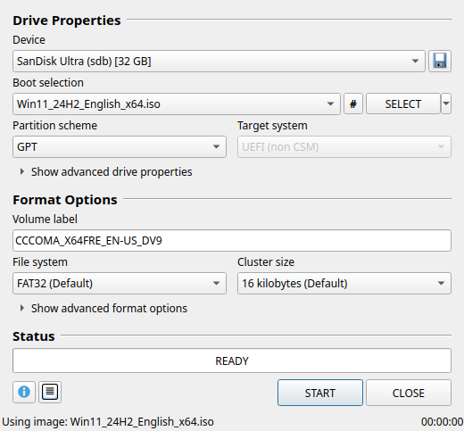

# Rufux — a Rufus-style bootable USB creator for Linux

Rufux brings the [Rufus](https://rufus.ie) workflow to Linux: pick a drive and an image, check
the options, and press **START**. It writes Linux ISOs, builds Windows 10/11 installation drives,
and formats USB sticks and SD cards. It runs on any modern Linux distribution.



> Rufux is an independent project inspired by Rufus. It is not affiliated with Rufus or its author.

## Features

- **Rufus layout and defaults.** Device, Boot selection, Partition scheme, Target system, Volume
  label, File system and Cluster size (using Rufus' cluster-size tables), advanced options, a
  status bar and a log window.
- **Linux images** (Ubuntu, Fedora, Debian, Linux Mint, openSUSE, Arch, …)
  - **DD image mode**, the default for ISOHybrid images: a raw copy, followed by a read-back
    verification.
  - **ISO image mode** (file copy): creates a normal FAT32/NTFS drive, patches boot-loader
    volume labels the way Rufus does, and supports a **persistent partition** for Ubuntu
    (casper) and Debian (live-boot) images.
  - Compressed images: `.img.xz`, `.gz`, `.bz2`, `.zst`, `.zip` and raw `.img`.
- **Windows 10/11 installation drives**
  - GPT + UEFI, or MBR + "BIOS or UEFI" (legacy BIOS boot uses GRUB to chainload `bootmgr`).
  - **FAT32 with automatic `install.wim` splitting** (via wimlib) when the image has a file over
    4 GB. This uses Windows' own signed boot files, so Secure Boot keeps working.
  - Or **NTFS/exFAT + UEFI:NTFS**, the same approach Rufus uses (a small FAT partition at the
    end of the drive holds Pete Batard's UEFI:NTFS driver).
  - The **Windows User Experience** dialog (same options as Rufus): remove the 4GB+ RAM, Secure Boot
    and TPM 2.0 requirements, remove the online Microsoft account requirement, create a local
    account, skip the privacy questions, copy your regional settings, and disable BitLocker
    automatic encryption.
- **Non-bootable formatting**: FAT, FAT32 (including "Large FAT32"), NTFS, exFAT, UDF,
  ext2/3/4, on MBR or GPT, with an optional quick format and extended label (`autorun.inf` + icon).
- **Bad blocks and counterfeit-drive check** (1–4 passes). Every block is tagged with its own
  index, so fake-capacity drives that wrap around are detected.
- **Save drive to image** (the 💾 button) and **checksums** (MD5/SHA1/SHA256/SHA512, with a
  "compare" box).
- **Safety first**
  - Only USB drives and SD cards are listed. Internal disks and anything that hosts `/`, `/boot`,
    `/home`, swap and so on are never shown. USB hard disks are hidden unless you tick
    *List USB Hard Drives*.
  - Before writing, the helper re-checks that the device path still refers to the same drive
    (size, serial, model) you selected.
  - It refuses to overwrite the drive that holds the image, unmounts the drive's partitions,
    and stops the desktop from auto-mounting it while writing.

## Installation

Rufux needs:

- **Python 3.10** or newer, with **PyQt6** or **PySide6** (either one works)
- **polkit** (`pkexec`), which every desktop has, to ask for your password when writing
- **util-linux** (`lsblk`, `sfdisk`, `wipefs`), **dosfstools** and **e2fsprogs**

Recommended extras: **wimlib** (lets Windows images with an `install.wim` over 4 GB stay on
FAT32), **ntfs-3g** (NTFS) and **exfatprogs** (exFAT).

Follow the section for your distribution: install the dependencies, download the source, then
install. Every method except the Arch package installs under `/usr/local`.

### Debian, Ubuntu, Linux Mint, Pop!_OS, Zorin OS, elementary OS

```bash
sudo apt install git make python3-pyqt6 pkexec dosfstools fdisk e2fsprogs
sudo apt install ntfs-3g exfatprogs wimtools    # recommended
git clone https://github.com/oreo1298/WindowsUSBLinux.git
cd WindowsUSBLinux
make uefi-ntfs.img                              # optional, see below
sudo make install
```

On older releases (Ubuntu 22.04, Debian 11) the `pkexec` package is called `policykit-1`. If
`python3-pyqt6` doesn't exist on your release, see [Without a packaged Qt binding](#without-a-packaged-qt-binding).

### Fedora

```bash
sudo dnf install git make python3-pyqt6 polkit dosfstools util-linux e2fsprogs
sudo dnf install ntfs-3g ntfsprogs exfatprogs wimlib-utils    # recommended
git clone https://github.com/oreo1298/WindowsUSBLinux.git
cd WindowsUSBLinux
make uefi-ntfs.img                                            # optional, see below
sudo make install
```

### openSUSE (Tumbleweed and Leap)

```bash
sudo zypper install git make python3-PyQt6 polkit dosfstools util-linux e2fsprogs
sudo zypper install ntfs-3g ntfsprogs exfatprogs wimtools    # recommended
git clone https://github.com/oreo1298/WindowsUSBLinux.git
cd WindowsUSBLinux
make uefi-ntfs.img                                           # optional, see below
sudo make install
```

### Arch Linux, CachyOS, EndeavourOS, Manjaro and other Arch-based distributions

The repository includes a PKGBUILD, so Rufux installs as a normal pacman package (with the
UEFI:NTFS image included):

```bash
sudo pacman -S --needed git base-devel
sudo pacman -S --needed ntfs-3g exfatprogs wimlib    # recommended
git clone https://github.com/oreo1298/WindowsUSBLinux.git
cd WindowsUSBLinux
makepkg -si
```

### Other distributions

Install the requirements listed above (plus `git` and `make`) with your package manager, then:

```bash
git clone https://github.com/oreo1298/WindowsUSBLinux.git
cd WindowsUSBLinux
sudo make install
```

### Without a packaged Qt binding

If your distribution has neither PyQt6 nor PySide6, install PySide6 from PyPI into a private
virtual environment and point the installed launcher at it (run this in the repository folder,
instead of the plain `sudo make install`):

```bash
python3 -m venv ~/.local/share/rufux-venv
~/.local/share/rufux-venv/bin/pip install PySide6-Essentials
sudo make PYTHON_GUI=$HOME/.local/share/rufux-venv/bin/python install
```

### Notes for every distribution

- **`make uefi-ntfs.img`** downloads the UEFI:NTFS boot image from the Rufus v4.15 release (with
  `curl` or `wget`) and checks its SHA-256, so `make install` can bundle it. It's only needed for
  NTFS/exFAT boot drives. If you skip it, Rufux offers to download it the first time you need it.
- **Legacy BIOS boot for Windows drives** (MBR → "BIOS or UEFI") needs GRUB's BIOS modules:

  | Distribution family | Packages |
  |---------------------|----------|
  | Debian / Ubuntu     | `grub-pc-bin grub2-common` |
  | Fedora              | `grub2-pc-modules grub2-tools` |
  | openSUSE            | `grub2-i386-pc` |
  | Arch-based          | `grub` |

  Installing these does **not** change your own boot loader. Rufux only runs `grub-install`
  against the USB drive.
- **UDF formatting** needs `udftools` (same name everywhere).
- Package names for Debian/Ubuntu were checked on Ubuntu 24.04. The Fedora and openSUSE names
  are the usual ones for those distributions; if one isn't found, search for it with
  `dnf search` or `zypper search`.
- When a tool is missing, Rufux tells you which package to install, using your distribution's
  package manager.

### Starting and updating

Start **Rufux** from your application menu, or run `rufux` (optionally `rufux some-image.iso`).
To update, run `git pull` in the repository folder, then install again: `sudo make install`,
or `makepkg -sif` on Arch-based distributions (the `-f` makes makepkg build the new version
instead of reinstalling the package it built last time).

### Running from source without installing

With the requirements installed, you can also run it straight from the repository:

```bash
./bin/rufux
```

Polkit then asks for your password to run `bin/rufux-helper`. Without the installed polkit
policy, the prompt shows the helper's full path instead of a friendly message.

## Uninstalling

Use the command that matches how you installed Rufux:

| Installed with | Remove with |
|----------------|-------------|
| `sudo make install` | `sudo make uninstall` (run it from the repository folder) |
| `makepkg -si` (Arch-based) | `sudo pacman -Rns rufux` |
| `sudo make install` with the PySide6 virtual environment | `sudo make uninstall`, then `rm -rf ~/.local/share/rufux-venv` |

Then remove your personal settings, the UEFI:NTFS download cache (only present if Rufux downloaded
it), and the repository folder:

```bash
rm -rf ~/.config/rufux ~/.cache/rufux
rm -rf ~/WindowsUSBLinux    # or wherever you cloned it
```

Packages you installed yourself (such as `wimlib`, `ntfs-3g`, `exfatprogs` or GRUB) stay
installed; remove them with your package manager if nothing else needs them. **Don't remove
GRUB if your computer boots with it.**

## Using it

1. **Device**: plug in the USB stick. It appears within a couple of seconds.
2. **Boot selection**: click **SELECT** (or drag and drop an image onto the window). Rufux
   analyzes the image and fills in the rest, the same way Rufus does. The **▾** next to SELECT
   has links to the official download pages of common distributions and Windows.
3. **Image option** (shown for ISOHybrid Linux images): *DD Image mode* is recommended. Choose
   *ISO Image mode* if you want a persistent partition or a drive that keeps a normal file system.
4. Check the partition scheme, target system, file system and label. The defaults are sensible.
5. Press **START**. For Windows images, the *Windows User Experience* dialog appears first. After
   that you get the usual `ALL DATA ON DEVICE … WILL BE DESTROYED` confirmation, then a polkit
   password prompt.
6. When the bar shows **READY**, the drive is done (and verified, unless you turned that off under
   *Show advanced format options*).

### Windows notes

- The default is **GPT / UEFI (non CSM) / FAT32**. If `install.wim` is larger than 4 GB, it is
  split into `install.swm` + `install2.swm`… (Windows Setup supports this natively). If
  `wimlib` is missing, or the image uses a solid-compressed `install.esd` larger than 4 GB,
  pick **NTFS** instead.
- **NTFS/exFAT** drives boot through UEFI:NTFS. Its loader and file system drivers are signed, so
  they also start with Secure Boot enabled. If a particular PC still refuses the drive, use FAT32
  or temporarily disable Secure Boot.
- For old BIOS-only PCs, choose **MBR** and **BIOS or UEFI** (needs `grub`).
- The customization options are written to `autounattend.xml` at the root of the drive. If you
  only chose options that apply after installation, they go to
  `sources/$OEM$/$$/Panther/unattend.xml` instead, which is the same split Rufus uses. With the
  requirement bypass enabled, `sources/appraiserres.dll` is also neutralized for in-place upgrades.

### Linux notes

- For ISOHybrid images (most Linux ISOs, such as Ubuntu, Fedora, Debian or Arch), **DD mode** is
  the right choice. It is a byte-for-byte copy, so both BIOS and UEFI boot work exactly as designed.
- **ISO mode** copies the files onto FAT32 and patches the boot configuration to use the USB
  volume label. It boots on UEFI systems only.

## How it works

- The GUI (Python + Qt 6, through PyQt6 or PySide6) runs as your normal user. It enumerates drives with
  `lsblk` and reads images with a built-in ISO 9660 / Joliet / Rock Ridge / UDF reader, the way
  Rufus uses libcdio.
- Writing needs root. A small helper (`<prefix>/lib/rufux/bin/rufux-helper`) is started through
  **pkexec**. Polkit caches the authorization for a few minutes. The helper reads one JSON job,
  reports progress as JSON lines, and can be cancelled at any time.
- The helper opens your image with *your* permissions, not root's. It re-validates the target
  drive, then uses standard tools: `wipefs`, `sfdisk`, `mkfs.*`, `mount`, `wimlib-imagex` and
  `grub-install`.
- Partition layouts follow Rufus. The main partition starts at 1 MiB (*Main Data Partition*),
  followed by optional persistence and, at the end of the disk, a *UEFI:NTFS* partition
  (a Microsoft basic data partition with the "no drive letter" attribute on GPT, type `0xEF` on MBR).

## Differences from Rufus

Not implemented: Windows To Go, FreeDOS, installing Syslinux/GRUB for *Linux* ISO mode (use DD
mode), and the built-in Windows ISO downloader (Fido). The **▾** menu next to SELECT links to the
official download pages instead.

Additions: verification of written data in both modes, compressed-image writing with progress,
a checksum compare box, and a *Safely remove the drive when finished* option.

## Troubleshooting

- **"Authorization failed or was cancelled"**: a polkit authentication agent must be running.
  KDE Plasma and GNOME include one. On minimal window managers, start e.g. `polkit-kde-agent`
  or `lxqt-policykit`.
- **My drive is not listed**: large or rotational USB disks count as *USB Hard Drives*. Tick that
  box under *Show advanced drive properties*. Internal disks are never listed.
- **"Could not unmount … the drive is in use"**: close any file manager window or terminal that
  has the drive open, then retry.
- The log window (📄 button) shows every command that was run. *Save* it when reporting a problem.

## Development

The tests use pytest (`python3-pytest` on Debian/Ubuntu and Fedora, `python-pytest` on Arch):

```bash
make test         # unit tests; the end-to-end tests also need root and loop devices
sudo make test    # runs everything, including real partition/format/copy tests on loop devices
```

`tests/vm/run.sh` is an optional full-system test. It starts your own system in a VM (with
[virtme-ng](https://github.com/arighi/virtme-ng)) with 8 virtual USB sticks attached. It runs
the helper against them with the real kernel file system drivers, then boots each resulting stick
in QEMU with UEFI (OVMF) and legacy BIOS to check that the expected boot loader really starts.
This covers Windows FAT32/NTFS/exFAT, GPT/MBR, UEFI:NTFS and BIOS boot through GRUB, hybrid DD
images, and Linux ISO mode with label patching:

```bash
sudo tests/vm/run.sh    # uses the running kernel; set KERNEL=/path/to/vmlinuz to pick another
```

Code layout:

- `rufux/core/`: Qt-free logic. The image reader (`isofs.py`), image analysis (`image.py`),
  drive enumeration (`blockdevs.py`), file system rules (`fsdefs.py`), UI decisions (`plan.py`)
  and the Windows answer file generator (`unattend.py`).
- `rufux/helper/`: the privileged helper. DD writing, ISO mode, partitioning, formatting, bad
  blocks, and saving a drive.
- `rufux/ui/`: the Qt interface.

## License

GPL-3.0-or-later, see [LICENSE](LICENSE).
The UEFI:NTFS boot image is © Pete Batard and licensed under the GPLv2+. It is downloaded from the
[Rufus repository](https://github.com/pbatard/rufus) when the package is built.
